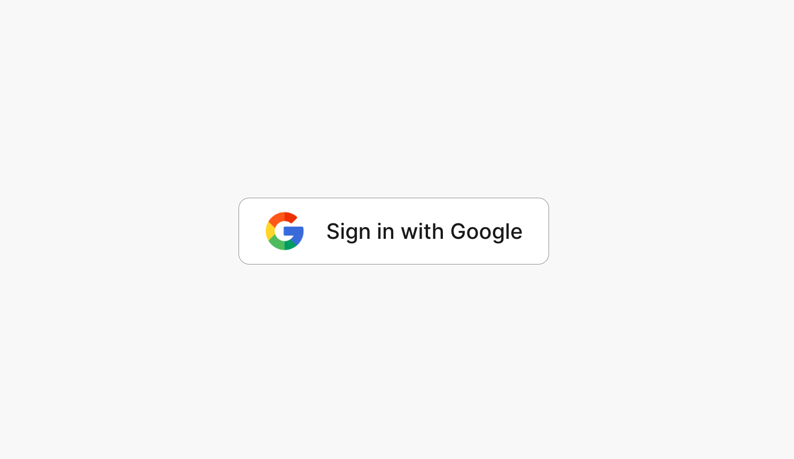

# Sign in with Google

Basic sign in with Google demo with video tutorial.



### Getting started

1. To get started clone repo: `git clone https://github.com/divanov11/apple-signin`

2. Switch to google sign in branch: `git switch google-signin`

3. CD into `final` OR `starter_code` folder

> `final` contains complete project, `starter_code` contains boiler plate code for you to build on top of.

```
npm install
npm run dev
```

4. Create a `.env` folder and add in your appwrite credentials. See `.env.example`

> NOTE: You'll need to create an account and get your project ID at appwrite.io
